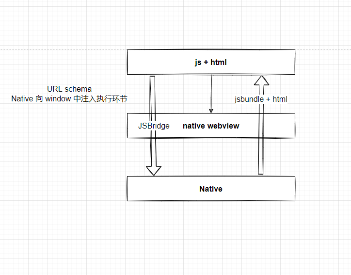

## 移动端跨平台方案的演进

### 当前热点

在 2021 JavaScript Rising Star： [链接](https://risingstars.js.org/2021/en#section-mobile)

- **React Native**
- lonic
- **Expo**
- Quasar
- Flipper
- Flutter

#### 演进历史

- Webview
  - URL schema -> 如果想用 web 调用一个 windows 的程序；
    - `schematransferprotocal://xxx.xxx?params1=xxx&params=2`；
    - Jssdk -- 微信小程序的 `jsbridge`；

Javascript Core : 相当于一个js执行引擎

js bridge 怎么和 native交互？

1. json序列化，进行交互 -> .json 过大、过长会有影响
2. 异步来交互

不同的技术实现下jsBridge有什么区别？
url schema - 如果想用 web 调用一个 windows 的程序
  windowSee://xxx.xxx?paaml=xxx=
  在注册表注册这个协议，运行cmd命令或者文件
  参考: jssdk -- 微信小程序jsbridge 
  // TODO: 看看 https://github.com/lzyzsd/JsBridge 这是个实现demo

其实可以看作，在js中建立和原生层api的通信，使用json进行传参（同时把回调参数带过去）

https://zhuanlan.zhihu.com/p/381459761

##### ReactNative （Weex）

- 他的目标不是一次编写，到处执行；而是，一次学习多处开发。不同平台上编写都是基于 React 的代码；
- Android 和 iOS 是有区别的，而且区别也比较大；
  - Web view ： 嵌入式浏览器；
  - JavaScript Core：
    - V8 -- chrome
    - spyderMonkey -- firefox
    - JS core -- safari

- Flutter
  - 1. flutter，他是直接基于原生的Native，有一个自己的渲染引擎，skia；
    2. flutter 在这种 iOS / android 端的一致性，其实要比 RN 好；
    3. flutter dart2，学习需要一定的成本；
- RN + Fabric

### 端与跨端

- 端：数据获取、状态管理、页面渲染。(FE三板斧)
- 跨端：虚拟机、渲染引擎、原生交互、开发环境。

#### 1. 数据获取

还是老三样：fetch \ axios \ XHR 

#### 2. 状态管理

React 中的 state 模式：redux / mobx

#### 3. 页面渲染

vDOM -> Fiber -> DOM 

vDom -> yoga -> iOS / android / DOM APIs  -> iOS / android / Web

#### 4. 虚拟机

##### RN:

- JSC - Objective-c / JS
- 到原生层，用了大量的 bridge

##### Flutter:

- JIT(dev) + AOT(prod)
- Skia 

- 生态问题

#### 5. 渲染引擎

yoga

#### 6. 原生交互

Jsbridge

#### 7. 开发环境

Web storm / VS code

- RN: Android SDK / Xcode
- React: node 浏览器