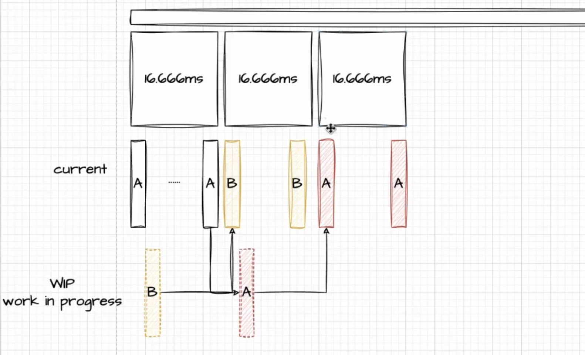

# react 源码

## 源码怎么学

### 关于 react 源码的一些误区

1. react源码，很多人都没读过；
2. 读过，和写的好不好没关系；
3. 不读依然能回答问题
4. 读了未必能面试过
5. 你为啥读源码？有啥帮助
    1. 心里有数
    2. 思想部分可借鉴
    3. 应付面试


### 一起思考一下

```jsx
<div>
    <h2>hello world</h2>
    <p>{text}</p>
    {
        data.map(item => <Children data={item} />)
    }
</div>
```
data 数据变更，怎么更新是最快的？
react 要保持运行时灵活性，最好办法就是从头遍历一遍，
**看一看，你改的，和之前有啥区别，然后把区别更新**

### react 版本


- V15 stack reconciler
    - 我从根节点递归遍历，慢，调用栈长

- v16.9 ~ v17.0.2 fiber reconciler
- 做一个异步可中断的更新
- v17.0.2的版本里，先把数据结构给你做了，再整一些不稳定的，但是也能用的东西，你可以试试；
- 我先吹出来，我要实现高优先级打断低优先级；

- v17.0.2
  legacy模式： CRA (create-react-app) 默认创建，我有 Fiber 的结构，但是我不会打断--xxx.old.js
  concurrent 模式： 可以实现高优先级打断低优先级的 --xxx.new.js
- v18 
    - concurrent 模式


### 双缓存

概念最早来自于 canvas ,用空间换时间，类似预加载



### react 中基本的数据结构

#### v-dom / element

#### fiber
```js

FiberNode = {
    tag, // 标明是什么类型的 fiber
    key,
    type, // dom 元素的类型

    // fiber 是链表的数据结构构建的
    return, // 指向父节点
    child, // 指向子节点
    sibling, // 指向兄弟节点

    // pendingProps, memoizedProps, updateQueue, memorizeState

    effectTag, // 用来收集 Effect
    nextEffect, // 指向下一个 Effect
    firstEffect, // 第一个 Effect
    lastEffect, // 最后一个 Effect

    alternate, // 双缓存数，current 指向对应 workInProgress 
}
```

##### workInProgress Fiber


##### current

#### Dom

### react 整体流程

#### render 开始的函数调用栈

- render
- LegacyRenderSubtreeIntoContainer 
    - 我先判断 root 的dom节点下，有没有 _reactRootContainer
    - 如果没有，进入 LegacyCreateRootFromDOMContainer
    - legacyCreateRootFromDOMContainer
        - 核心，就是创建根 Fiber 节点
        -  createLegacyRoot
            - new ReactD0MBlockingRoot
            - createRootImpl
            - createContainer
            - createFiberRoot
    - updateContainer
    - **scheduleUpdateOnFiber**
        - markUpdateLaneFromFiberToRoot
        - **performSynWorkOnRoot**
        - renderRootSync
            - workLoopSync

```js
function workLoopSync() {
    while (workInProgress !== null) {
        performUnitOfWork(workInProgress)
    }
}
```

- performUnitOfWork

react-reconciler react 调和器工作流程
beginWork -> completeWork -> commitWork

beginWork 给变动的fiberNode 打上 flags: 标志更新、删除、新增
completeWork 处理所有打上 flag的节点，串成 EffectList 
最后在 commitWork 中一次性提交 （创建真实dom）

#### 递归流程

```js
function performUnitOfWork() {
    next = child = beginWork(current, unitWork);
    if(next == null ){
        next = completeUnitOfWork(unitWork)
    }
}
```

##### beginWork：创建你的 workInprogressFiber

使用 v-dom 和 current fiber 对比，向下调和的过程
就是由 fiberRoot 按照 child 指针逐层往下调和，期间会执行 函数组件、类组件，diff 子节点，打上不同的 effectTag

```js
function beginWork (current, workInProgress) {
    switch(workInProgress.tag) {
        case IndeterminateComponent:
        case FunctionComponent:
        case ClassComponent:
        case HostComponent:
    }
}
```

对于组件，执行部分生命周期，执行render，执行函数，得到最新的 vdom -children
- 向下遍历调和 children
- 打上不同的 effectTag - flags


##### completeWork：根据 effectTag  创建 effectList 以及创建真实的 dom|

是向上归并的过程，如果有兄弟节点，会返回sibling 兄弟，
- 生成 effectList
- 构建真实的 dgg，但是我没有挂载到界面上
    - **createlnstance**

#### 第三步
commitWork

#####

位置
**performSynWorkOnRoot**

- commitRoot
    - runWithPriority$1
        - commitRootImpl

##### flushPassiveEffect

- 处理一些还没有执行完的 useEffect

##### commitBeforeMutationEffects - 更新前
- getSnapshotBeforeUpdate

##### commitMutationEffects - 更新

- mutation 阶段
- 処理 Placement, Update, Deletion

##### root.current = finishedWork = workInProgress Fiber;

最后打包
|---react---| |---react-dom-------------------------|
|---react---| |--react-reconciler--| |--react-dom---|
## Q
#### 为什么 React 要用 fiber

stack reconciler 是同步的，要做个异步可中断的更新

#### 什么是 fiber
本质上是一个数据结构
