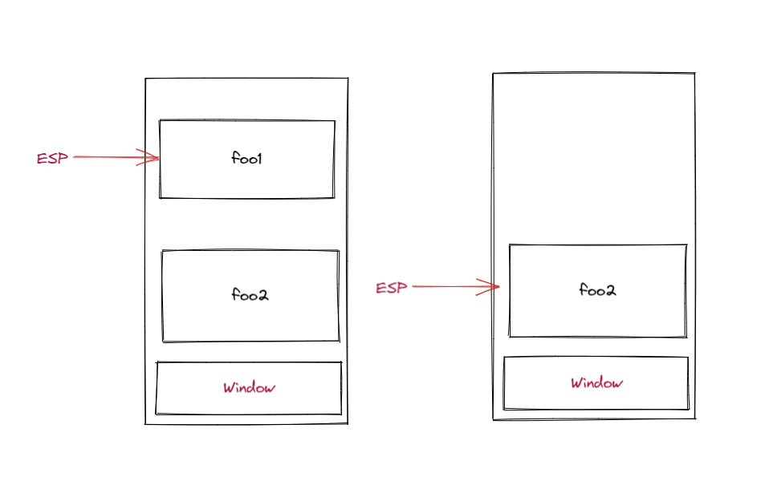

## 那些我所知道的前端的内存处理

> 对于任何语言来说，内存管理、垃圾回收等知识都是进阶路上绕不开的坎。出来面试估计也没少被问到“前端的内存处理你了解么？ 你知道js中的垃圾处理机制吗？ 什么情况会导致内存泄漏呢？

### 一、内存的储存和代码执行的场所关系

#### 1. 储存空间，主要是两种：

    * 栈空间：
        1. 存储原始类型
        2. 执行上下文 （代码空间：主要存储可执行代码）

    * 堆空间：存储引用类型

*为什么不都用栈存呢？*

因为需要用栈来维护程序执行期间上下文的状态，如果栈空间大了话，所有的数据都存放在栈空间里面，那么会影响到上下文切换的效率，进而又影响到整个程序的执行效率。

#### 2. 内存的生命周期

内存分配：声明变量 函数 对象的时候
内存的使用：读写内存，使用变量 函数等
内存回收：使用完毕，由垃圾回收机制自动回收不再使用的内存

#### 3. js 中的内存分配和使用

```js
// 分配
const num = 123;
const str = 'sss';

// 使用

const a = 10;
console.log(a); // 使用

```
#### 4. 调用栈下移ESP(记录当前执行状态的指针也叫栈指针，属于指针寄存器的一种 Extended stack pointer)
当一个函数执行结束之后，JavaScript 引擎会通过向下移动 ESP 来销毁该函数保存在栈中的执行上下文。
比方下面这个例子通过ESP 状态来展示就如图所示。
```js
var foo1 = () => {
    console.log('foo1')
    foo2()
}
var foo2 = () => {
    console.log('foo2')
}
foo1()
```

被ESP指针移开后的函数作用域foo1 明显属于不在被引用，后续将会直接被GC回收
### 二、 js中的垃圾回收机制

有C语言经验的开发者，一定明白内存声明分配好之后，需要手动 `free` 的操作，这就是手动回收。而 Js 本身是自动回收机制，所以开发者不需要过多关注内存分配和释放的问题。这些工作都让 V8 引擎中的垃圾回收器（GC）给承包了。

最早接触 js 的时候，市面上对于 js 内存管理、垃圾回收主要讲的是下面两种概念：


#### 1. 引用计数法

引用计数法的算法主要依赖于引用的概念，这个回收机制最早是在 IE 在使用的。目前主流浏览器都使用标记清除法了。看一个对象是否有指向他的引用，如果没有其他对象指向他了，说明当前这个对象不再被需要了。

他的缺陷在于：**循环引用**

如果两个对象相互引用，尽管他们已不再被使用，但是引用计数无法识别，导致内存泄漏。


#### 2. 标记清除法（Mark-Sweep）

将“不再使用的的对象”定义为“无法到达的对象”

从根部js的全局对象触发，定时递归扫描内存中的对象，凡是无法从根部到达的对象，就会被标记为不再使用，稍后进行回收

执行过程如下：
* GC在运行的时候会给内存中的所有变量都加上标记
* 将从根部触发能够触及到的对象标记清除
* 剩下的还有标记的变量被视为准备删除的变量
* GC销毁带有标记的值 回收内存空间

### 三、代际假说和分代收集

代际假说（The Generational Hypothesis）是现代浏览器垃圾回收策略的基础。整个模型可以看看下图

#### 新生代（副垃圾回收器）
存放的是生存时间短、占用空间较小的的对象，通过 `Scavenge` 算法，是把新生代空间对半划分为两个区域，一半是对象区域，一半是空闲区域。新的对象都要放到对象区，当快满的时候，将还存活的对象复制到空闲区后进行角色互换。并且执行**对象晋升策略**，对象区域和空闲区域**翻转两次还存在**的对象，升级到老生代。这个复制翻转的过程也避免内存碎片的产生。


#### 老生代（主垃圾回收器）
存放的生存时间久的对象，使用标记清除的算法进行垃圾回收。一旦执行垃圾回收算法，都需要将正在执行的 JavaScript 脚本暂停下来，待垃圾回收完毕后再恢复脚本执行。这种行为称为全停顿（Stop-The-World）。实际上浏览器为了避免垃圾回收卡顿通过**增量标记**方式将回收任务拆解成多个小任务穿插在js主线程中执行。

ps: 代际假说中，新生代老生代的变化在下面环境都有不一样的逻辑（java/nodejs/原生js(v8))

### 四、常见的内存泄漏

#### 1. 全局变量

```js

function foo() {
    bar1 = 'aaa'; // 相当于声明在window.bar1
    this.bar2 = 'aaaa'
}

foo(); // 执行函数事this指向window ,相当于一个函数给全局变量增加了两个变量
```

#### 2. 未被清理的定时器和回调函数
```js
//setInterval
//setTimeout

setInterval(() => {
    console.log('test')
}, 500)

//没用用 clearInterval clearTimeout 做清除
```
#### 3. 闭包

个人最喜欢《你不知道的js》里对闭包的描述
> 一个内部函数，有权访问包含其的外部函数的变量 —— 《你不知道的js》
或者也可以用“内存逃逸”这种高逼格的属于形容。

```js
// 闭包 gc 案例
var one = null;
var replace = function() {
    var originalOne = one;

    var unused =function() {
        if(originalOne) {
            console.log(111);
        }
    }

    one = {
        longString: '111',
        method: function() {
            console.log()
        }
    }    
}


setInterval(replace, 500)
```
每次调用 `replace`, `one` 得到一个包含字符串和一个对于新闭包 `method` 的对象 `unused` 引用了 `originOne`

#### 5. DOM 引用
```js
var elements= {
    image: document.getElementById('111');
}

elements.image = null;
```
#### 6. 怎么避免呢？

尽量减少全局变量
使用完引用数据后，及时解除引用.null
避免死循环等持续执行的操作
多使用 WeakSet / WeakMap 特性

### 其他

#### 1. 实现一个sizeof 函数

接收一个对象参数，计算传入的对象所占的Bytes数

#### 2. 优化代码内存管理的特性？ WeakSet/ WeakMap 的运用