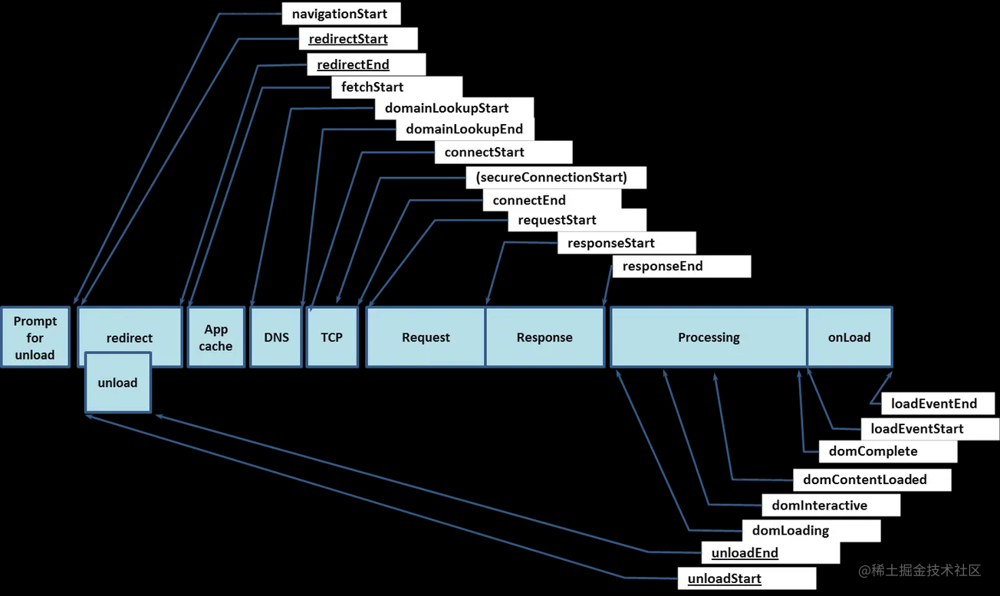

# 前端性能优化合集

性能优化可以说是对前端所有分支学科汇总的一个集合，每个分支都有需要优化的地方，优化的目的不外乎提升体验，不论用户体验还是开发体验。
本篇性能优化总结了一个 5 年+前端应知应会的各项优化指标、方式。从 Website 运行各阶段的各种优化相关的事务归纳汇总到这篇笔记里，已经实际工作中性能优化在整个开发流程中的接入点和接入位置，方便工作学习过程中查漏补缺。

关于性能优化, 逐步把 [processOn](https://www.processon.com/mindmap/601a31e707912901722406e9) 对应性能优化的内容总结进来，逐步丰满这个笔记

## 优化维度：从 url 开始

- unload 阶段 redirect 阶段
- app cache 阶段
  - 协商缓存，强缓存。(那种协商缓存好？好在哪？)
    - hash/ time
    - 启发式缓存？
  - 持久化
    localStorage
    indexDb
- dns 阶段
  - dns 预解析
    1. `<meta http-equiv="x-dns-prefetch-control" content="off">` `content="off"`的意思是关闭隐式预解析（默认情况下，对于 a 标签来说，浏览器会对当前页面中与当前域名不在同一个域的域名进行预获取，并且缓存结果）但是对于 https 就失效了使用方式 `<meta http-equiv="x-dns-prefetch-control" content="on">`
    2. `<link rel="dns-prefetch" href="http://www.test.com" />` 不知道协议情况下： `<link rel="dns-prefetch" href="//test.com" />` 不要写重复的预解析
- tcp 阶段，request, response 阶段
  - connectStart -- responseEnd;
  - http 1.1
  - http 2
  - http 3
  - CDN 加速
  - 包体积 main.min.js 如何缩小加载 js 到极致
    - code splitting
    - uglyfily
    - preset-env
    - common module (怎么异步加载，按需加载模块)
  - 如何和 tcp 请求数量之间做 trade off
- dom 阶段
  - async defer 标签并行下载延迟解析
    - `<script async src="script.js"></script>`
    - `<script defer src="script.js"></script>`
  - js/css 等引用位置
    js 加载阻塞 dom 和 cssmos 执行， 因此 js 放下边，css 放在上边
  - css prefetch / preload
    link 标签 `rel = "preconnect | preload | prefetch | prerender"`
  - code splitting(不该加载的东西 参考 coverage 指标)

---

## Browser Performance 优化指标



### 性能优化监听 API

1. Performance.performance.now()与 new Date()区别，它是高精度的，且是相对时间，相对于页面加载的那一刻。但是不一定适合单页面场景。
2. window.addEventListener("load", ""); window.addEventListener("domContentLoaded", "");
3. Img 的 onload 事件，监听首屏内的图片是否加载完成，判断首屏事件。
4. RequestFrameAnmation 和 RequestIdleCallback。
5. IntersectionObserver、MutationObserver，PostMessage。
6. Web Worker，耗时任务放在里面执行。
   有特定业务需要特殊定制或者需要搭建性能监控平台造轮子的，需要上面的 api 封装成定制的监控模块。由于部分 api 由宿主环境对象提供，对于多段适配公共监听需求的开发需要特定的 polyfill

### 优化指标

```js
let t = performance.timing
console.log('DNS查询耗时 ：' + (t.domainLookupEnd - t.domainLookupStart))
console.log('TCP链接耗时 ：' + (t.connectEnd - t.connectStart))
console.log('request请求耗时 ：' + (t.responseEnd - t.responseStart))
console.log('解析dom树耗时 ：' + (t.domComplete - t.domInteractive))
console.log('白屏时间 ：' + (t.responseStart - t.navigationStart).toFixed(0)) console.log('domready时间 ：' + (t.domContentLoadedEventEnd - t.navigationStart)) console.log('onload时间 ：' + (t.loadEventEnd - t.navigationStart))
```

- 白屏时间：从输入 URL 开始，到页面开始有变化，只要有任何像素点变化，都算是白屏时间的完结。
- 首页时间：指当 onload 事件触发的时候，也就是整个首页加载完成的时候。或者说：原始文档和所有引用的内容已经加载完成。用 `loadEventEnd - fetchStart` 计算

```js
function getFirstPage() {
  const firstPage =
    performance.timing.loadEventEnd - performance.timing.fetchStart;
  console.log('FIRST_PAGE', firstPage);
}
```

#### 1. **FP** [(First Paint)](https://web.dev/fp/)首次绘制

指页面上第一个像素、色块变动

#### 2. **FCP** [(First Content Paint)](https://web.dev/fcp/)首次内容绘制

值页面上绘制了第一个元素

> FP 与 FCP 的最大的区别就在于： FP **指的是绘制像素**，比如说页面的背景色是灰色的，那么在显示会泽背景时就记录下了 FP 指标。但是此时 DOM 内容还没开始绘制，可能需要文件下载、解析等过程，只有当 DOM 内容发生变化才会触发，比如说渲染出了一段文字，此时就会记录下 FCP 指标。因此我们可以把这两个指标认为是和白屏时间相关的指标，所以肯定是越快越好。

#### 3. FMP (First Meaning Paint)首次有效绘制

有一定争议性，指的是页面中有效内容绘制，对于每个网站来说有效内容不同，一般不做研究。
TODO：对应争议链接

#### 4. **TTI** [(Time To Interact)](https://web.dev/tti/)首次可交互时间

ps:也可以用`DomReady - domContentLoadedEventEnd`的时间节点

需要满足已下条件:

  1. 从 FCP 指标后开始计算;
  2. 持续 5 秒内无长任务（执行时间超过 50 ms ) 且无两个以上正在进行中的 GET 请求;
  3. 往前回溯至 5 秒前的最后一个长任务结束的时间;

通俗点说就是 FCP 完成后 5秒内没有超2个 50ms 的执行时间的任务，参考图 TODO: TTI 图片
解决方式：看 long task 执行的 O(n) 时间复杂度

#### 5. DCL: domContentLoaded TODO:

与 onload 区别：
  `DOMContentLoaded` 事件在页面文档加载解析完毕之后马上执行。而不会等待图片文件和子框架页面的加载，`load` 事件会在页面所有资源被加载进来之后才会触发 load 事件。
**注意：load 时间在 DOMContentLoaded 事件触发之后**

#### 6. [TTFB](https://web.dev/ttfb/) TODO:

### 2020 年中提出的新指标 (包括 CLS FID LCP)

#### 1. **CLS**: 累计位偏移量 = 位移影响面积 \* 位移距离

```js
function getCLS() {
  try {
  let cumulativeLayoutShiftScore = 0;
    const observer = new PerformanceObserver((list) => {
      for (const entry of list.getEntries()) {
      // Only count layout shifts without recent user input.
        if (!entry.hadRecentInput) {
          cumulativeLayoutShiftScore += entry.value;
        }
      }
    });
  observer.observe({type: 'layout-shift', buffered: true});
  }
}
```

#### 2. **FID**： 首次输入延迟

记录在 FCP 和 TTI 之间用户首次与页面交互时响应的延迟

```js
function getFID() {
  new PerformanceObserver((entryList, observer) => {
    let firstInput = entryList.getEntries()[0];
    if (firstInput) {
      const FID = firstInput.processingStart - firstInput.startTime;
      console.log('FID', FID);
    }
    // observer.disconnect();
  }).observe({ type: 'first-input', buffered: true });
}
```

#### 3. **LCP** 最大内容绘制

用于记录视窗内最大的元素绘制的时间，该时间会随着页面渲染变化而变化，因为页面中的最大元素在渲染过程中可能发生改变，另外该指标会在用户第一次交互后停止记录。

### 优化

#### CLS 优化

文档结构相同：脱离文档流 VS 不脱离文档流
文档结构相同，脱离文档：Position
脱离之后 CLS： 0 对原本文档流没有影响
不脱离文档流: 使用 transform
宽高相同
指定图片高度

1. 如果经常需要变动的元素，脱离文档流，或者是占据位置，只是隐藏
2. 对于唯一等操作，使用动画代替
3. 在定义图片的时候，就应该给出具体的宽高

#### TTI/FID 优化

1. long task 开启 web work 新起线程不影响 main.js
2. 异步引入或者按需加载高 TTI 的脚本

#### 其他解决方案 TODO

1. 提高带宽
2. 工程加速
   webpack tree-shaking 剪枝
   减小 js
   url-loader 小图标 base64 || 图片转 font 字体
3. 路由懒加载，只有在使用的时候进行路由加载
4. 对网络资源进行 CDN 加速
5. app cache
6. gzip: 具体说就是————客户端 Gzip 离线包，服务器资源 Gzip 压缩 （也可通过br压缩）
7. 对于少量小图标（单个尽量不要超过 10k), 我们可以用 url-loader 打包。或者使用将图标转化非字体库，异步进行加载
8. 对于大图标的话，需要做到在展示的时候再去加载。也就是当图片出现到浏览器窗口的时候再去加载，而不是首屏的图片全部加载（Chrome 本身在光栅化阶段有视口优先渲染的优化）


1. 图片，图片占位，图片懒加载。 雪碧图  图片压缩以及 进行图片Webp打包（结合静态页面可以上传对象存储进行cdn管理）
2. 使用框架的 prefetch / preload 预加载等新特性
3. 服务器合理设置缓存策略
4. async（加载完当前 js 立即执行）/defer(所有资源加载完之后执行 js)
5. 减少 Dom 的操作，减少重排重绘
6. 从客户端层面，首屏减少和客户端交互，合并接口请求。
7. 数据缓存：前端数据持久化 + 缓存策略
8. 首页不加载不可视组件。
9. 防止渲染抖动，控制时序。
10. 减少组件层级。
11. 优先使用 Flex 布局。
12. 组件库按需加载和异步引入
13. 国际化项目的词条按需加载

#### 图片格式优化

- 老旧的雪碧图....
- png jpg jpeg gif webp base64 icon: svg 这些格式特点是什么？ // TODO: Render-raster 中对图形解码变成位图的过程
  图片格式 jpg、png、gif各有什么优缺点？什么情况下用什么格式的图片呢？ - 赵鑫的回答 - 知乎
  https://www.zhihu.com/question/20028452/answer/142593276
- 为什么用 base64 什么时候用？
- 为什么图片 base64 之后会比原先的文件体积大 1/3？

// TODO: 默认背景色有助于对字体清晰显示，因为可以通过读取背景色对字体渲染时使用亚像素抗锯齿增加清晰度（适用于清晰度不高的屏幕）

**bigPipe** 服务端渲染的优化点

`bigPipe` 是由 facebook 提出来的⼀种动态⽹⻚加载技术。它将⽹⻚分解成称为 pagelets 的⼩块，然后分块传输到浏
览器端，进⾏渲染。它可以有效地提升⾸屏渲染时间。
可以看出，bigpipe 的适⽤是服务端进⾏渲染，然后将⼀块⼀块的⽂件传递给前端。
那么为什么需要分块传输呢？

继续做对照试验：
分块传输 VS 不分块传输
可以明显的看出，在不进⾏分块传输的时候，需要经过漫⻓的等待，界⾯才能看到变化。ssr 渲染的宗旨就是更快
的渲染，然⽽在⻓任务时候，效果不理想。

- fragment
- img

减少回流

哪些会导致回流？

- 首次渲染
- 窗口变化，元素尺寸变化
- 元素内容变化，字体变化
- 添加、删除 dom

`clientWhide` / `clientHeight`
`offSetWidth` / `offSetHeight`
`getBoundingClientRect()`

如何避免？？
尽可能不在前面改变 dom(页面上段结构)
避免使用 table 布局
动画效果，absolute fixed

GPU 如何触发渲染？

## 工具

1. `web-vitals`: 一个前端框架，不需要你单独写 performance api
   缺点： 目前只能统计 `CLS | FCP | FID | LCP | TTFB` . 如果需要扩充可以另写 `Performance` 进行改造。

2. Chrome DevTools：Lighthouse
   Lighthouse 前身是 Audits 在 Chrome 83 之后是 Lighthouse。 之后有很多其他变更，例如将 FMP 从评分指标中换成其他指标。同时测试指标中会提示出需要优化的地方，已经该项指标的解读说明。
3. [PageSpeed](https://developers.google.com/speed/pagespeed/) 插件: 需要服务器环境

4. [WebPageTest](https://webpagetest.org/easy) 一个测试 Performance 指标的网站，输入指定网站来测试指标，自带 `Site Performance | Core Web Vitals | Lighthouse ...` 选项；
5. [siteSpeed](https://www.sitespeed.io/)
6. [Measure](https://web.dev/measure/) 和 webPageTest 类似的在线测试网站
7. [JsPref](https://github.com/jsperf/jsperf.com) 一个用于测试 js 代码性能的工具（相关在线网站需要 Github 进行登录），可以本地按照脚本来使用.

PS: 基建好的公司会具备一个性能检查的平台，在CI/CD 过程中对部署好的页面执行性能检测脚本，然后以邮件或者工单的形式形成报告发给对应的提交者。

## 检验指标

上面介绍了这么多的优化方式和工具，性能优化如何作用在软件研发工作流中的？

一般来说，制定性能指标首先会以一个统一指标模板开始制定，最后根据业务情况来逐步调整为符合自身情况的指标模式

### [RAIL](https://web.dev/rail/) 优化指标

RAIL 是一种以用户为中心的性能模型，它提供了一种考虑性能的结构。该模型将用户体验分解到按键操作（例如，点击、滚动、加载）中，帮助您为每个操作定义性能目标。

- Response: 事件处理最好在 50ms 内完成
- Animation: 在 10ms 内产生一帧
- Idle: 最大化空闲时间
- Load: 传输内容到页面可交互的时间不超过 5 秒
  具体的方法：
  1. 优化阻塞资源标签
  2. chrome DevTool 有个分析必要 js 的功能(coverage)。参考那个把一些次要脚本剥离出来延迟加载。

### 开发流程中的指标考察点

// TODO: 业务指标、技术指标
// 提测前的验收 e2e 报告 、 性能报告平台
