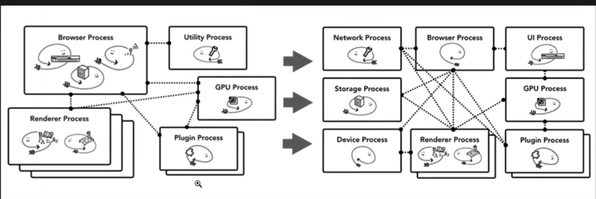

# 浏览器原理

1. CPU
中央处理器，串行地一件接一件的处理交个他的任务。
cpu在现代电脑一般有多个核心，8 core, 4 core

这里的核心指的是物理上的概念。核指物理上的核心单元组

2. GPU
图形处理器，单个gpu只能处理简单任务，但是数量特别的多！！！并行计算能力非常的强 


3. 进程 & 线程

进程 -  可以把他看做一个被执行的应用程序 & CPU 资源分配的最小单位；

线程 - 进程 包含 线程， 一个进程会包含一个或多个线程 & CPU 调度的最小单位

进程隔离：操作系统会为进程分配一个独立内存
pid processid
当执行一个应用程序的时候，操作系统会为此程序分配一个进程，会有一块独立的内存空间。
当进程技术的时候，此内存空间会被释放掉。

## 浏览器架构

Browser Process(一个) ： 负责浏览器主体部分，包含导航栏，书签，前进，后退按钮
Network(一个)：网络进程，负责页面的网络资源加载
GPU(一个)：图像渲染进程，不同的tab是有不同的渲染进程，gpu需要接收这些进程的请求并且绘制页面（与JS 引擎线程互斥）
Renderer(多个):渲染进程，标签页内核网页展示相关的所有工作，html css js 转换为用户可以交互的网页， **默认情况**下每个tab有一个独立的渲染进程。
Plugin(多个):插件进程。
其他进程：工具进程、辅助框架、JS 引擎线程 、 定时器触发线程 、 事件触发线程

### 多进程架构的好处是什么？

1. 容错性

不同的tab拥有不同的渲染进程，相互独立，一个tab挂掉不会影响其他的tab进程运行

2. 安全性和沙盒性

浏览器不希望用户可以拥有太多修改底层逻辑的能力，而用户的代码其实是跑在渲染进程里。所以浏览器需要限制渲染进程的能力。

3. 每个进程可以拥有更多的内存

因为每个进程都会分配一块独立的内存空间。


### 多进程的坏处是什么？


有些比较公共的东西，会在不同的进程内存空间中存在，就消耗了不比要的内存空间

- Chrome怎么优化这种情况？

限制启动的进程数目。当启动的进程数达到上限后，访问同一域名的tab都会放在一个进程里。

- Chrome的服务化

将某些大的服务拆分成小服务模块，当遇到性能好的设备时，每个服务可以有独立的进程，保证系统的稳定性；当遇到性能不好的设备时，这些服务会被集中在一个进程里，减少内存的消耗。

### 网站隔离

iframe

当tab页存在跨站的iframe(iframe 与当前主页面域名不一样),那么这个iframe会拥有独立的渲染进程。（对应上面说的 浏览器架构 - Renderer渲染进程的**非默认情况**

b.com
iframe a.com

### 导航时究竟都发生了什么？

1. url解析
2. dns查询
3. tcp连接
4. 发送Http请求
5. 接收http响应请求
6. 页面渲染
  1. 解析html,构建dom树
  2. 解析 css,构建css规则书
  3. 合并dom树和css规则树，生成render树
  4. 布局render树
  5. 绘制render树，
  6. 浏览器将各层的信息发送给GPU, GPU将各层合成，显示在屏幕上

上面是从宏观角度来解析的，那么我们从浏览器进程的角度来看一下。

#### 处理输入

UI线程 来判断输入的内容是关键词还是url?

#### 开始导航（开始进入网络进程）

当用户按下回车，UI线程会通知网络进程来初始化一个网络请求，来获取站点内容。

- 如果遇到 301

网络进程会通知UI线程进行重定向，然后再发起一个网络请求

- DNS查询是在哪里做的？ 

网络进程，在收到UI线程的通知后开始做的

#### 读取响应（网络进程内）

1. 需要做响应类型的判断

Content-Type: application/json
通过响应头来判断主体，或者（如果没有头）通过响应数据流开头的部分来判断数据类型

2. 不同响应类型的处理

* html, 浏览器会将获取到的数据交给渲染进程
* 压缩文件/其他类型，会交给下载管理器来处理(图片、zip...)

3. 安全检查（将数据交给renderer线程前的操作）
比如检查是否和已有病毒页面匹配？或者检查是否是跨站数据？


#### 寻找一个渲染进程来绘制页面

网络请求的耗时是不固定的，或许会比较长？UI线程就在摸鱼吗？

其实UI进程在网络进程干活的时候就给网络进程启动一个渲染进程了。如果没有安全问题或者重定向，就能直接用事先准备好的这个渲染进程来渲染内容了。如果出现异常，准备好的会被舍弃掉，然后创建一个新的。

在网络请求的过程中，UI线程会提前创建一个渲染进程做准备

* 如果一切顺利，那么就直接用这个渲染进程工作
* 如果发生重定向或者安全问题，那么准备好的这个渲染进程就会被舍弃掉，重新开启一个渲染进程


#### 提交导航

 数据、渲染进程准备好，浏览器将Network 获取的数据提交给渲染进程

 导航过程即将结束。

#### 加载完成

渲染进程: 加载资源 渲染页面

当渲染进程完成渲染， load, 会通过IPC 告诉浏览器进程，让UI线程停止导航栏/tab上的转圈

#### 渲染进程中具体做了什么？

1. 构建dom

渲染进程接受html文本数据，并且把他转换为dom对象。(文本Tokenization)

解析过程中会报错吗？

```html

Hi !<b>I<i></b>!</i>
```
```html

Hi !<b>I<i></i></b><i></i>!</i>
```

2. 加载子资源

遇到<link>/之类的标签会调用网络进程发起网络请求

3. js会阻塞HTML的解析进过程吗？

会！会转想js代码的加载解析和执行

js代码里可能会写document.write("")


...
#### 样式计算

主线程会解析页面的css来确定每个dom节点的计算样式 computed style


#### 布局 layout

1. 主线程会遍历刚刚构建的 dom树，根据dom节点计算样式来计算出一个布局树
2. 布局树上的每个节点会有它在页面上的x, y 坐标，以及盒子大小的具体信息。 visible

display: none (不会在布局树上)
visibility: hidden (会在布局树上)


什么时候会触发回流呢？


页面图形属性的改变
浏览器窗口的 resize
offetTop 等熟悉的获取
...


为什么动画提倡transform 而不是用left属性来做动画？看demo


由于每次重排/回流 都会造成额外的消耗，所以大多数浏览器都会通过队列化修改来批量执行优化重排过程（flush)
flush:[a,b,c,...]

offsetTop

当你获取布局信息的操作时，这些信息都会返回最新的数据。
浏览器不得不清空队列，触发回流重绘来返回正确的值。

#### 绘制

z-index


渲染流水线：解释为什么回流必然重绘，重绘不一定会回流。 因为先 layout 再 paint


ps： dnsprefetch
碰到带标签的资源解析。提高子资源解析速度

### 练习题

1. 地址栏输入一个url会发生什么

2. js会阻塞HTML的解析过程吗？为什么？

3. 什么情况下触发回流/重排？浏览器自身有什么优化？

4. 如何尽量避免回流的出现

5. 浏览器多进程架构的好处


z-index使用条件有哪些？什么时候生效