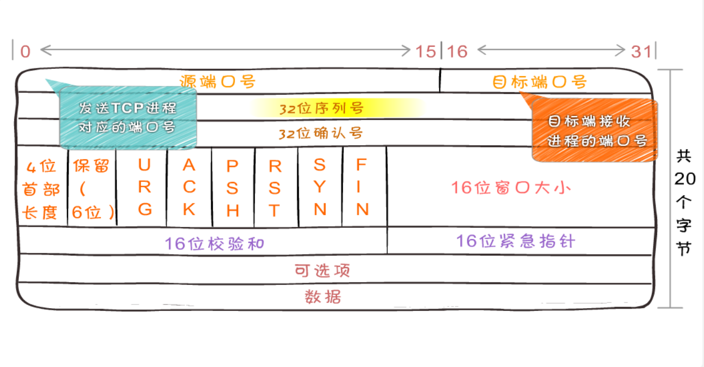
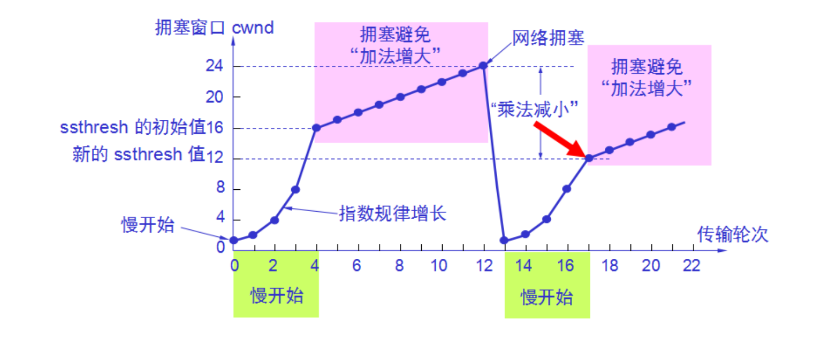
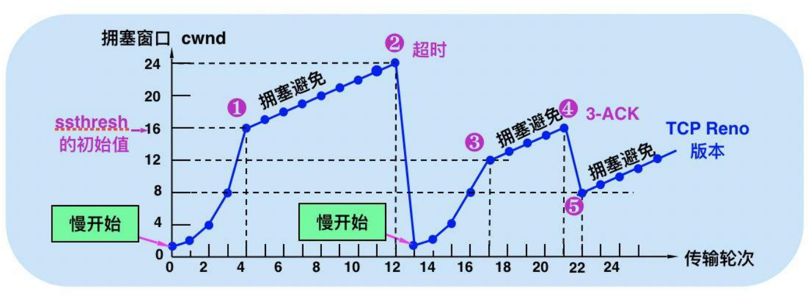

## TCP 和 UDP

> 两个协议都在传输层，我们常说 TCP 是面向连接而 UDP 是面向无连接的。

* UDP 发出请求后，不考虑对方是否能收到、内容是否完整、顺序是否正确。收到数据后也不会进行通知。
* 首部结构简单，在数据传输时能实现最小的开销

ps: 直播有可能基于UDP或者TCP, 主要看看有没对丢包有强的要求

### TCP 传输控制协议 Transimision control Protocal
> **可靠、面向连接的传输协议**，传输效率低（特点：在不可靠的 IP 层上简历可靠的传输层）。TCP 提供全双工服务，即**数据可在同一时间双向传播**。

#### 1. 数据格式

不算可选 20个字节。1字节 = 8bit(8位)

为什么说TCP是双工的？

http1.0 四次挥手的问题。

为了防止最终ACK 丢失，发送ACK后需要等待一段时间（TIME_WAIT ~ CLOSED） ，因为如果丢包服务器端需要重新发送FIN包，如果客户端已经closed,那么服务端会将结果解析成错误。从而在高并发非长连接的场景下会有大量端口被占用，一旦超过最大端口数（65535）就不能在创建新的端口。

所以http1.1 提出了 keep-alive 长连接复用

### UDP

面向无连接、快速。

可以基于 udp 实现可靠的协议（http/3)

### 滑动窗口

- 窗口协商

* 滑动窗口(控制流量的方式)：TCP 是全双工的，所以发送端有发送缓存区；接收端有接收缓存区，要发送的数据都放到发送者的缓存区，发送窗口（要被发送的数据）就是要发送缓存中的那一部分

特点：
- 客户端有自己的缓存区，服务端也有自己的缓存区。会根据网络状况调整发送数据的多少
- 我们发送数据的时候是乱序发送的，但是当我收到某个包后，可能之前的包没有收到，此时需要等待前面序号的包到了才可以（队头阻塞：头回来了才能往后滑动）
- 服务端会和客户端说明发送数据的个数
- 如果某个数据丢包了，那需要重新发送（超时重传 RTO ,性能最差)ps: 数据包的序号就是那个seq
- 当接收方的缓存区收满了，需要每隔一段时间由发送方发出一个探测包，来询问能否调整窗口的大小。上层协议消耗掉了接收方的数据，接收方也会主动通知发送方调整窗口，继续发送数据 PSH。
- 流量控制 控制发送方的频率。

* 核心流量控制：在建立连接时，接收端会告诉发送端子机的窗口大小（rwnd),每次接收端收到数据后都会再次确认(rwnd) 大小，如果值为0，停止发送数据。（并发送窗口探测包，持续监测窗口大小）

> 滑动窗口的算法

ps: 1帧 ≈ 1500字节： ip头 20个字节 tcp 头 20个字节 = tcp 1460字节

### 粘包

nagle（node内置） 算法的基本定义是**任意时刻，最多只能有一个未被确认的小段**（TCP内部控制）

Cork 算法 当达到MSS(Maximum Segment Size：最大帧尺寸) 值时统一进行发送（此时就是帧的大小 - ip 头 - tcp 头 = 1460 字节）理论值

粘包就是通过Cork算法把多包粘成一个包发送

### TCP 拥塞处理 （队头阻塞：若果在非长连接的情况会有大量端口被占用）

> 举例：假设接收方窗口大小是无限的，接收到数据后发送 ACK 包，那么传输数据主要是依赖于网络带宽，带宽的大小是有限的。

* TCP 维护一个拥塞窗口 `cwnd` (congesion window) 变量，在传输过程中没有拥塞就将此值增大。如果出现拥塞（超时重传 RTO(Retransmission TimeOut) ) 就将窗口值减少

* cwnd < SSTHRESH 使用慢开始算法
* cwnd > ssthresh 使用拥塞色避免算法
* ROT 时更新 ssthresh 值为当前窗口的一般，更新cwnd = 1 

三个TCP问题：
1. 队头阻塞
2. 慢启动，这时候出现慢启动的问题(每次重传需要慢启动...效率不高)
3. 短连接

用快重传处理因为丢包导致超时重传的慢启动。
> 快重传，可能在发送过程中出现丢包情况。此时不要立即回退到慢开始阶段，而是对已经收到的报文重复确认（通过后续接受的包的ack)，如果确认次数达到三次（ack应答3次），立即进行重传**快恢复**算法（减少超时重传机制的出现），降低重置 cwnd 的频率，cwnd 用原本的一半而不直接从 0 开始。

> 这是在 TCP Reno 版本实现的，之前的慢启动是 TCP Tahoe 版本

### TCP 的一些问题/缺陷
- TCP顺序问题：后面的包先到达，需要等待前面的猫返回之后才可以继续传输（队头阻塞问题）**（等窗口头部包完成传输才能往后滑动）**
- 慢启动的过程，非常消耗性能
- time-wait 客户端连接服务器最后不会立即断开，在高并发、短连接的情况下，会出现端口全被占用导致新的请求无法连入。（time-wait 指的是四次挥手断开方最后一次ACK后到CLOSED的这段时间）

### 小结：TCP 的控制手段、优化手段
控制手段
  1）滑动窗口控制传输速度
优化手段
  2）粘包（短连接） cork nagle
  3）拥塞处理 快重传快恢复（恢复成原来 ssthresh 的一半 TCP Reno）

