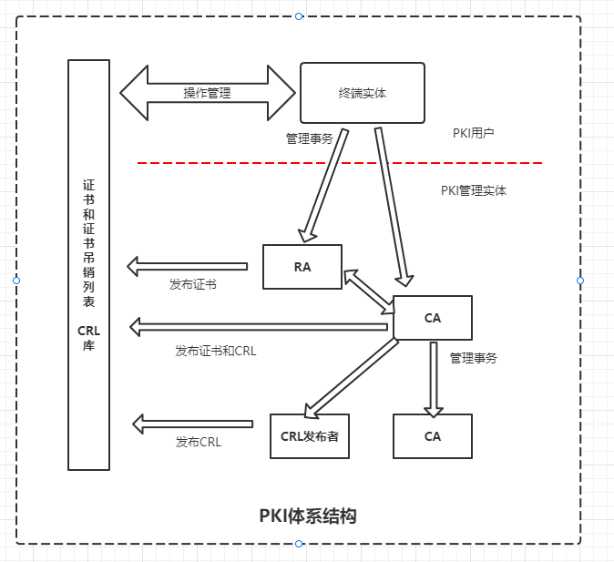
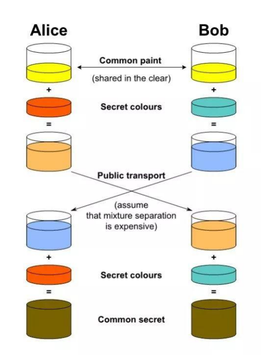

## HTTPS 

#### 为什么需要HTTPS？
因为HTTP采用明文传输，中间人可以获取到明文数据（从而实现对数据的篡改）。这时候`HTTPS` 就登场了！

#### HTTPS是什么？
 `HTTPS` = `HTTP` + `SL/TLS`，`SSL` 也叫安全套接层（`Secure Sockets Layer`) 发展到 V3版本的时候改名为 TLS 传输层安全（`Transport Layer Security`），相当于在 `HTTP` 和 `TCP` 中间加了个门卫，主要的目的就是提供数据的**完整性和保密性**。

## 一、如何保证数据完整性？

为了达到完整性和保密性 `https` 做了三件事
* 加密：对传输的数据进行加密。
* 数据一致性：保证传输过程中数据不会被篡改
* 身份认证：确定对方的真实身份。

#### 1. 摘要算法（Hash)
我们可以给内容增加一个摘要，在传输到服务端后再把内容做一次摘要，看一下两次摘要后的结果是否一致
（可以根据摘要来辨别数据有没有被篡改）因为篡改的数据和篡改前的摘要肯定不同

#### 2. 对称加密(发送方和接收方都有一把公钥)

对称加密通过 XOR 异或运算实现同一个秘钥进行加密解密，这是对称加密实现的核心。

缺点是：同一个接收方多次传输容易被破解。
> AES(Advanced Encryption Standard 高级加密标准) ChaCha20 为google推出的最常见的对称加密算法。

AES 的加密步骤：
  1. 把明文按照 128bit(16字节) 拆分成若干个明文块，每个明文块是 4*4 矩阵
  2. 按照选择的填充方式来填充最后一个明文块
  3. 每个明文块利用 AES 加密器和秘钥，加密成密文块
  4. 拼接所有的密文块，成为最终的密文结果

#### 3. 非对称加密（发送方和接收方都有一把钥匙 发送方会拿到公钥 接收方会拿到私钥）

- 私钥加密公钥解密
- 公钥加密私钥解密 

只能解决一半问题...,只能一方加密通信,虽然我们可以靠两套钥匙实现通信，但是问题是性能和效率都不高，数据越大加解密越复杂指数型增长。

e.g. RSA算法中公私钥（ca证书也会用到)

#### 4. 混合加密
简单说就是：对称加密 + 非对称加密。通过非对称加密解决秘钥传输问题，数据传输利用对称加密问题（公私钥 + 随机数）
（最终用于通讯的秘钥还是客户端生成的）

即使我们做到这个程度了，还是有问题：因为**中间人攻击可以伪造公钥**，你不知道这个公钥是谁发给你的（属实两头骗了）。

## 二、 数字证书和CA（Certificate Authority）
数字证书：包含**用户公钥**和**CA用私钥进行的签名**两个部分组成，CA私钥将证书信息进行摘要
> 因为谁都可以发布公钥，所以我们需要一个非对称密码的应用来验证对方身份。防止中间人攻击。

#### 1. 证书加密过程

 
 1. 当客户端访问服务器的时候，服务器会生成自己的私钥和公钥 -> 将**公钥**传递给CA进行认证（CA机构也有自己的公钥私钥，它会把内容进行一个签名（直接把证书用私钥签名内容太多，那么我们把证书进行摘要（hash），将摘要的结果用私钥加密）; 这一步很大程度都是在服务端和CA机构完成
> 客户端会判断有效期、颁发者、证书是否被修改及证书是否被吊销。每份签发证书都可以根据验证链查找到对应的根证书，操作系统、浏览器会在本地存储权威机构的根证书，利用本地根证书可以对对应机构签发根证书完成来源验证。

  2. 客户端要拿到服务器的公钥。客户端会在操作系统中放入根证书，所以收到证书后可以进行验证签名（用内置的CA公钥进行解密，可以解密出摘要）将传递的明文再次摘要和我解密出来的摘要进行匹配，如果一直那么这个公钥就是合法的。这时候有人问：如果把服务器公钥放在明文里不是将公钥暴露了么？因为CA这个环节是为了保证服务器公钥不被篡改，中间人无法解密客户端发来的数据，所以没有问题。

      **再次强调：上面两步核心目的都是为了防止服务器公钥被篡改**

  3. 后面就创建会话秘钥进行长连接通信了 ...
  
##### 证书的知识点补充：
 - 公钥类型：RSA(1024Bits) RSA(2048Bits) ECDHE....
 - 基于私钥加密，只能用公钥解密：起到身份的认证使用
 - 公钥的管理： 通过 Public Key Infrastructure(PKI) 公钥基础设施
    - 有数字证书认账机构将用户个人身份与公开秘钥关联在一起
    - 公钥数字证书组成
      - CA 信息、公钥用户信息、公钥、权威机构签字、有效期
    - PKI 用户
      - 向CA注册公钥的用户
      - 希望使用已注册公钥的用户
      - CA 负责颁发证书
      - RA 负责审核用户身份

#### 2. 如何确认证书有效期？

 客户端获取到证书验证签名之后，会去检测吊销状态，CA会在两个地方部署证书有效性的信息列表。
  1. 去CRL服务器（CRL服务器是基于链表结构的，效率有限）查询
  2. 去 OCSP 响应程序查询

## 3. 握手过程

TLS handshake 过程可以看一下下面这张图

主要看1~4这是个过程。
1. 客户端发送 "Client Hello"
2. 服务端 发送 "Server Hello" 然后把证书放里面
3. 接受之后根据服务端发来的加密套件配置加密策略
4. 改变服务端加密套件

完成上述步骤之后，我们来看看这个过程中最重要的协商内容，加密套件。

##### 加密套件
我们通过抓包工具可以在握手过程中抓到 `cipher suit: TLS_ECDHE_RSA_WITH_AES_256_CBC_SHA` 这样的字段。
`cipher suit` 是用于握手阶段使用的加密套件协商字段，可以看做是服务端和客户端进行协商使用那些加密、解密的密码本，协商成功后就用这套密码本来解密两端的悄悄话。TLS(协议)_ECDHE(秘钥交换协议)_RSA(签名算法)_WITH_AES_256_CBC(对称加密算法)_SHA(消息认证码)

[测试TLS站点安全套件支持情况](https://ssllabs.com/ssltest/index.html)

##### ECDHE协议：
下面是ECDHE 的过程
1. 客户端给服务端传递了一个随机数C
2. 服务端也给客户端传递了一个随机数S
3. 服务端给客户端一个serverParmas (DH 参数)
4. 客户端给服务端一个clientParams (DH 参数)

服务端会话密钥 = 随机数C + 随机数S + serverParams + clientParams 
客户端会话密钥 = 随机数C + 随机数S + serverParams + clientParams
服务端会话密钥 == 客户端端会话密钥
（通过这些就协商出一个会话秘钥）

而 随机数C 和 随机数S 作用：**防止中间人Dos攻击。校验到前后两次相同随机数直接不回应**
弄这么麻烦的原因：ECDHE 协议是基于 DH(Diffie-Hellman) 算法来实现会话秘钥生成的
DH 参数是明文的，中间人能拿到，但是DH算法中生成的中间值无法被拿到，给会话秘钥带来很高的安全性。

##### DH 升级 ECDH(基于椭圆曲线)
因为 DH 的算法中有大量乘法，运算比较慢。而ECDH 是基于 ECC（Elliptic Curve Cryptography)椭圆曲线生成的。更快，同等安全条件下秘钥更短。

RSA 和 DH 的区别:
RSA 由客户端决定，用长度来提高算法破解难度。而DH 是双方共同协商

### 理论上所有加密都会被高强度算力的设备破解，那还有什么方式？

[量子通讯](https://baike.baidu.com/item/%E9%87%8F%E5%AD%90%E9%80%9A%E4%BF%A1/6909117)（基于光波粒二象性曲线），原理在于每增加一个通讯节点就直接影响信息正确率，让通讯双方察觉被窃听。

## 三、总结一下

整个 HTTPS 的过程可以总结为 对称 + 非对称 + 摘要算法（hash / MD5 / SHA)

#### 优点
1. 增加数据的准确性和可靠性(安全可靠),使用 `HTTPS` 协议可认证用户和服务器，确保数据发送到正确的客户机和服务器。

2. 增加中间人攻击的成本
      - `HTTPS` 是现行架构下最安全的解决方案，虽然不是绝对安全，但它大幅增加了中间人攻击的成本。

3. SEO 友好、容易获得更好的搜索排名
      - 谷歌在2014跳转搜索算法，采用 `HTTPS` 加密的网站在搜索结果中的排名将会更高。
      - 百度也在2018年发布百度对 `HTTPS` 站点的扶持态度，表明 `HTTPS` 将作为优质特征之一影响搜索排序。

#### 缺点和局限

1. 高能耗
  - 请求加载：因为多加了一层握手加密环节，相比 http 会消耗更多的时间和算力。
  - 成本增加：证书的使用需要花费，DV OV EV三种证书一个比一个贵，虽然他们的效果都差不多
  > Tips: CA证书分 DV、OV、EV 三种可信程度
  > DV 最低，只是域名级别可信。EV 最高，经过法律、审计的严格核查，可以证明网站拥有者的身份

2. HTTPS连接缓存不如HTTP高效
  HTTPS连接缓存不如 HTTP 高效，会增加数据开销和功耗，甚至已有的安全措施也会因此而受到影响。

3. 仍然具有有局限性
      - CA证书在某些国家可以控制 CA 根证书的情况下，中间人攻击一样可行。参考斯诺登事件...
      - TLS1.2 版本中仍然在使用的一些低版本加密套间存在被强行破解的风险

## 文章参考链接
[1.
 The Transport Layer Security (TLS) Protocol
                              Version 1.1
](https://datatracker.ietf.org/doc/html/rfc4346#:~:text=RFC%204346%20The%20TLS%20Protocol%20April%202006%201.,TLS%20Record%20Protocol%20and%20the%20TLS%20Handshake%20Protocol)

[2.
Hypertext Transfer Protocol -- HTTP/1.1
](https://datatracker.ietf.org/doc/html/rfc2616/#:~:text=A%20feature%20of%20HTTP%20is%20the%20typing%20and,an%20update%20to%20RFC%202068%20%5B%2033%20%5D.)

[3. 深入理解HTTPS原理、过程与实践](https://zhuanlan.zhihu.com/p/26682342)